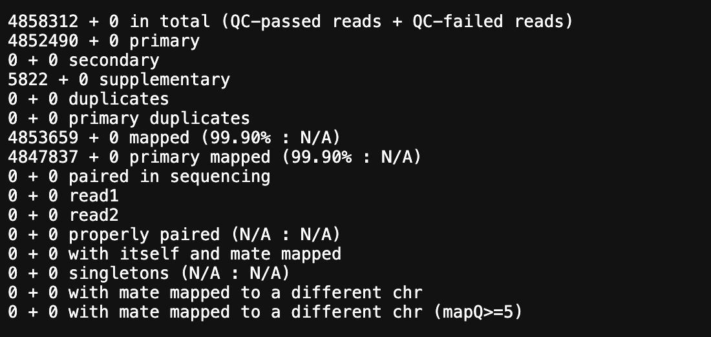

# 🧬 Étape 3 : Alignement des lectures avec BWA-MEM

## 🎯 Objectif pédagogique

Aligner les reads nettoyées (FASTQ) sur le génome de référence humain (GRCh38), afin de produire un fichier BAM nécessaire à l’appel de variants.

---

## 🔗 Lien vers Galaxy Europe

👉 [https://usegalaxy.eu](https://usegalaxy.eu)

---

## 📝 Pré-requis

- Vous devez avoir un fichier FASTQ propre issu de l'étape Cutadapt.
- Galaxy doit déjà contenir le génome de référence GRCh38 (sinon, vous pouvez l’importer ou le sélectionner dans les options).

---

## 🧰 Outil utilisé

**BWA-MEM**  
(Burrows-Wheeler Aligner – Maximal Exact Match)

C’est un des algorithmes d’alignement les plus utilisés pour les données NGS courtes (Illumina), notamment pour les exomes.

---

## ⚙️ Étapes à suivre dans Galaxy

1. Tapez **BWA-MEM** dans la barre de recherche
2. Cliquez sur **BWA-MEM 

### 📌 Paramètres à configurer :

- **Will you select a reference genome from your history or use a built-in index?**  
  → `Use a built-in genome index`

- **Select reference genome**  
  → `Human (Homo sapiens): hg38` (GRCh38)

- **Single or paired-end reads?**  
  → `Single-end` (ou `Paired-end` selon ton fichier)

- **FASTQ file**  
  → Sélectionne le fichier de Cutadapt (`Galaxy41-[Cutadapt on data 29_ Read 1 Output].fastqsanger´)

- Laissez les autres options par défaut

➡️ Cliquez sur **Run Tool**

---

## 🟰 Résultat obtenu

BWA-MEM génère un fichier **BAM** (Binary Alignment Map) contenant les lectures alignées :
- [➡️ Voir et télécharger le fichier BAM]-(https://drive.google.com/file/d/1CJ-dJwYiLG3xfI8FT45MblIL0iiDNLYr/view?usp=drive_link)
- [➡️ Voir et télécharger le fichier Bai]-(https://drive.google.com/file/d/1yy-Q7aF13LLGznjFRtMhcHr_ZKtAP11D/view?usp=drive_link)

Ce fichier BAM sera utilisé pour :
- Visualisation avec IGV
- Appel de variants (GATK)
- Statistiques d’alignement

---

## 📊 Vérification de l’alignement

Tu peux utiliser **SAMtools flagstat** pour évaluer la qualité de l’alignement :

1. Recherche **SAMtools flagstat** dans Galaxy
2. Applique-le au fichier BAM généré
3. Analyse le pourcentage de lectures mappées

---

## ✅ Bonnes pratiques

- Vérifie que le taux de mapping est > 95 % pour un exome de bonne qualité
- En cas de taux faible, revoir le trimming ou l’identifiant du génome
- Indexe le fichier BAM avec **SAMtools index** si nécessaire pour IGV

---

##🟰 Résultat obtenu
- 

