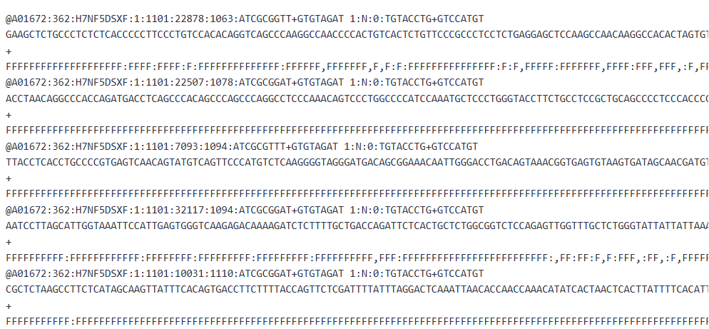

# 🧪 Étape 1 : Contrôle Qualité des Lectures – FastQC

## 🎯 Objectif pédagogique

Avant toute analyse bioinformatique, il est crucial d'évaluer la qualité des données de séquençage brutes (au format FASTQ). Cette étape permet d'identifier les problèmes éventuels (biais, adaptateurs, séquences de faible qualité) et de décider des étapes de nettoyage nécessaires.

---

## 🔗 Lien vers Galaxy Europe

Nous utiliserons l'instance Galaxy Europe, accessible sans inscription :  
👉 [https://usegalaxy.eu](https://usegalaxy.eu)

---

## 📁 Données utilisées

Pour ce TP, nous allons analyser un fichier FASTQ d'exome humain :

-(https://drive.google.com/file/d/1NPX9jtgKhjIv0eH_4zcPl4CbL9qjfwx7/view?usp=sharing)

## 🔍 Inspecter un fichier FASTQ brut

Avant d’utiliser un outil d’analyse de qualité, il est recommandé d’examiner rapidement le contenu du fichier FASTQ pour repérer d’éventuels problèmes évidents.

---

### 📄 À quoi ressemble un fichier FASTQ ?

Chaque lecture (read) dans un fichier FASTQ est représentée par **4 lignes** :

1. Une ligne d’identifiant (commence par `@`)
2. La séquence nucléotidique (A, C, G, T)
3. Un séparateur `+` (parfois suivi du même identifiant)
4. Une ligne de scores de qualité (encodés en ASCII, un caractère par base)

> Exemple de lecture dans un fichier FASTQ :
Dans Galaxy :
1. Cliquez sur **Upload Data** (icône en haut à gauche)
2. Collez l’URL dans l’onglet **Paste/Fetch Data**
3. Cliquez sur **Start** puis **Close**

   
---

### 👀 Aperçu dans Galaxy

Une fois votre fichier `.fastq.gz` téléversé dans Galaxy :

1. Cliquez sur **l’icône en forme d’œil** 👁️ dans le panneau latéral (Historique).
2. Faites défiler pour voir les lectures brutes.
3. Vérifiez :
   - La **longueur des séquences** est-elle homogène ?
   - Les lignes d’identifiants sont-elles cohérentes ?
   - Y a-t-il des caractères inhabituels ou des bases `N` ?

> Cette vérification rapide permet d’anticiper les erreurs détectées par FastQC.

---

### 🖼️ Exemple visuel

 

*Figure : Structure typique d’un fichier FASTQ (source : Galaxy Training Network)*

---

### ✅ Astuce

Si vous observez :
- Des lignes de séquence et de qualité de **longueur différente**
- Des bases inconnues (`N`) ou caractères inhabituels
→ Il est possible que le fichier soit corrompu, tronqué ou de mauvaise qualité.

---

➡️ [Étape suivante → Exécuter FastQC](#exécuter-fastqc)

---

## ⚙️ Utilisation de l'outil FastQC

### 🔍 Description
FastQC est un outil d’analyse rapide de la qualité des fichiers FASTQ. Il fournit des graphiques et résumés pour détecter :
- Les bases de faible qualité
- Les adaptateurs résiduels
- Les biais GC
- Les duplicats

### 📌 Étapes à suivre sur Galaxy :

1. Dans la barre de recherche Galaxy, tapez **FastQC**
2. Cliquez sur l’outil `FastQC: Read Quality reports`
3. **Paramètre à configurer** :
   - `Short read data from your current history` → sélectionnez votre fichier `.fastq.gz`
   - Laissez les autres paramètres par défaut
4. Cliquez sur **Execute**

---

## 📊 Résultats obtenus

FastQC génère deux fichiers :
- **`fastqc.html`** → rapport interactif 
- [➡️ Voir et télécharger le rapport HTML](reports/FastQC_on_data_29__Webpage_html.html) 
- **`fastqc_data.txt`** → données brutes du rapport

### ✅ Points à observer dans le rapport :

| Rubrique | À vérifier | Interprétation |
|----------|------------|----------------|
| Per base sequence quality | Score moyen par base > 20 | Bonne qualité |
| Adapter Content | Présence d’adaptateurs ? | Si oui → trim requis |
| Per base GC content | Distribution symétrique | OK si pas trop biaisée |
| Sequence Length Distribution | Uniforme ou variable ? | Peut indiquer des artefacts |
